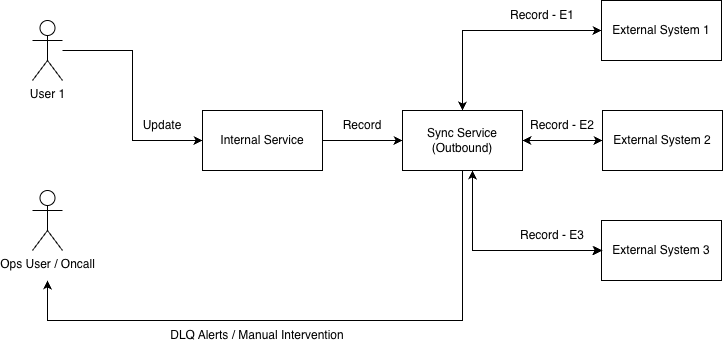
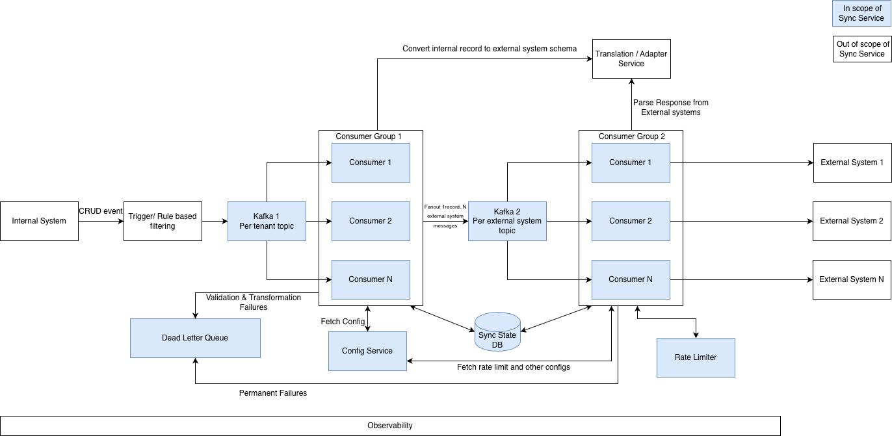

# Sync Pipeline - Staff Assignment

## Problem statement (Provided)

1. Outreach's sync team is responsible for bidirectional data sync between multiple services. For the sake of this assignment - the sync process is limited into 2 types of services - 
   1. Internal services (full access to data, services)
   2. External services (interaction via REST apis)
2. This is a record-to-record synchronization service signifying each record translates to a actionable item for the sync service.
3. The system handles CRUD operations between both systems.
4. The system must handle over 300 million synchronization requests daily.
5. The system must have near real time latency.
6. System should have 99.9% availability.
7. External APIs cannot support unlimited requests. 
8. Some data transformations are required to map between internal and external schemas. 
9. The system must support multiple CRM providers. 
10. Synchronization must occur record-by-record. 
11. Input/output should be validated against predefined schemas. 
12. Data must be transformed into/from the specific object models before being processed.
13. Sync actions (CRUD) are determined by pre-configured rules or triggers

## Sub-Problem Picked

As mentioned in the assignment, only a part of the whole system needs to be designed and implemented.

There are multiple sub problems to this service from a very high level.

1. Internal to External data sync.
2. External to internal data sync.
3. Consistency issues and resolution.
4. Data transformer layer.
5. Trigger rule engine, etc.

I am choosing Internal to External data sync process for this assignment. The following document contains the HighLevelDesign (design decisions, tradeoffs, design diagrams, etc.)

## Requirements

### Functional Requirements

1. The service synchronizes Create, Update, and Delete operations between an internal system (System A, fully owned) and external systems (System B, CRMs accessible only via API). READ is out of scope for this assignment. Only internal to external synchronization is in scope of this assignment.
2. The service handles many tenants concurrently. Each tenant's data, rate limits are stored and processed separately from other tenants.
3. The service integrates with multiple external CRM providers. Provider-specific differences (schema, rate limits, etc) are encapsulated behind pluggable interfaces so new providers can be added without core changes.
4. Data is transformed between internal and external schemas before being written. The transformation layer is pluggable per-provider and per-direction.
5. Operations on the same record must be applied to the destination in the order they occurred at the source. Operations on different records may be applied in parallel.
6. External API rate limits are enforced per-tenant, per-provider. Without per-tenant scoping, one hot tenant would consume the shared quota and starve quieter tenants.
7. Each sync operation is delivered at least once in effect, across retries, transient failures, and crash recovery. Few external systems should be able to handle duplicate writes on their own (using idempotency key) but for others at least once write is guaranteed. 
8. All events entering the pipeline and all payloads sent to external systems are validated against predefined schemas. Validation failures are non-retryable.
9. A single record change in the source can be configured to sync to multiple external CRMs, each with its own provider, schema transformation, and rate limit. Each destination is an independent delivery. This configuration is maintained as part of this service.

### Non-Functional Requirements

1. Throughput: 300M events/day (provided) translates to average ~3,500 events/sec. Traffic is bursty, not smoothed — for this assignment, assuming a 10× burst factor (~35,000 events/sec peak). Goal of service is to absorb and smooth these peaks while respecting downstream rate limits; it cannot propagate burstiness directly to external APIs.
2. Tiered latency - "Near real-time" - I have classified it based on data types being synced. Any tenant can have at least one or all data types.
   1. Critical: p95 < 2s
   2. Standard: p95 < 5s
   3. Background: p95 < 15s
   For the sake of simplicity I have implemented considering single data type.
3. Availability: 99.9%. Availability is tracked independently per tenant and per provider.
4. Failure isolation - A single failing tenant, degraded provider, or malformed record must not degrade service for other tenants or providers. 

### Assumptions
1. Upstream system exists and is multi-tenant - A pre-existing internal system handles multi-tenant data operations. This sync service consumes change events from it; it does not replace it.
2. Trigger/rule engine is out of scope - The logic that decides which state changes trigger a sync (and to which CRMs) lives upstream, outside this service. Those rules are assumed to be configurable and extensible, but the engine itself is not part of this assignment.
3. Events arriving at this service are pre-decided sync intents. By the time an event reaches this pipeline, the upstream trigger engine has already decided it must be delivered. The pipeline does not filter, deduplicate, or re-evaluate rules — goal is to deliver every message received to external system reliably.
4. READ operations are not synced. The problem statement lists READ as an operation type. Scoped out for simplicity.
5. Rate limits vary per tenant. Each (tenant, provider) pair has its own rate-limit budget. Enterprise tenants may negotiate higher limits than the provider default; config supports per-tenant overrides.
6. Conflict resolution is out of scope. When a write to an external system would conflict with concurrent changes (version mismatch), this service rejects the write and surfaces the conflict. Deciding who wins is handled by an upstream reconciliation service.
7. Upstream ordering is preserved at the source. The internal system emits events for the same record in the order operations occurred.
8. Authentication and credential management are out of scope. External API credentials are assumed provided and its management is not in scope.
9. I have not mentioned about observability in this document but it is a necessity for this scale. 

## Context Diagram

Uploaded xml also

## Container Diagram

Uploaded xml also

## Sync Service Design Decisions

### Service Invocation (Push vs Pull)

There are 2 ways to invoke sync service for any record - either internal systems push this data to service or sync service pulls the record to sync it.

There is an explicit requirement that all the events will not be synced and based on pre configured rules - a rule engine will decide which event will be synced to which external system.

Now lets compare the pros and cons of both push vs pull : 
#### Push : 
1. The sync service should be able to consume the messages at the same rate as produced. If consumer throughput is breached - producer need to store messages, maintain order and retry them.
2. If sync service is not available - it is the responsibility of consumer to store messages, maintain order and retry them.

#### Pull : 
1. The consumer needs to store the message at their end before they are being pulled by sync service.
2. Extra latency introduced due to the time gap between message is produced vs pulled by sync service.

Pull is the selected method here as it makes consumer more self reliant and removes dependency from sync service.
So internal systems will write records / messages in order into a durable log.

### Message transmission (DB/ FIFO SQS/ Kaka)

Internal system after filtering the message using rules , need to pass the messages to sync service while maintaing order. 
Thus, a system where sync service exposes an api for receiving messages while persisting messages at their end will not work as order will not be guaranteed.

We need a reliable and durable way to pass these messages. Let's compare the 3 available options:

#### DB -
1. Schema limitation introduced.
2. Write / read will have similar scale - maintaining 35000 events/sec on db can be challenging. Needs sharding.
3. Db only provides commit (storage) - it will be reinventing services like kafka again. (How do consumers read parallely? How to partition effectively?)
4. (Pros) Audit history / status of records can be maintained using db.

#### FIFO Queues (SQS) - 
1. Normal FIFO SQS has 300 events/sec rate limit, but in some regions it can be increased (these regions will contribute to latency).
2. Creating new queues for each tenant and maintaining them will be hard on scale.
3. No retry support.
4. (Pros) Message Delay and DLQ support out of the box.

#### Kafka
1. Partitions are ordered.
2. Durable, replayable.
3. Adding new tenants will not hurt.
4. No limitation due to rate limits. (enforced by internal team so can be changed per usage).

To maintain the scale and growing demand, kafka is selected otherwise FIFO SQS can be leveraged.

#### Kafka config 1
1. Separate topic per tenant : 
   1. Each tenant will have N partitions. 
   2. record_id will be hashed to a partition.
   3. Implementation is simple and clean - also each tenant will be independent completely.
   4. Can cause issue as brokers can handle 10000 partitions gracefully.
2. tenant_id#record_id as partition key :
   1. Data of tenants are not isolated.
   2. One hot partition (due to one tenant) can delay messages of other tenants.
   3. True parallelism for tenants cannot be achieved. Scaling consumers of a partition will be tough.
   4. Can be solved by adding tiered routing and another layer of queue sets.

I am preferring option 1 due to mentioned reasons.

### Kafka config 2
1. Separate topic for tenant : partition key = external_system_id#record_id
2. Separate topic for external system : partition key = tenant_id#record_id

I am preferring option 1 due to tenant data isolation and straight forward implementation of tenant level limits.

## Sync State DB

### Purpose
1. Track lifecycle of any record in sync service. Used for debugging.
2. To avoid duplicate work wherever possible.
3. To build idempotency checks on external system. (why not rely on external system? 1. Not necessary every system supports this. 2. Even if supported the timerange can exceed the issue duration)

### Options

#### Postgres
1. Sharding to maintain data peak.
2. SQL features provided but also schema limitation.
3. Data cleanup needs to be configured.
4. Transaction and ACID properties are out of the box.

### Redis

1. Fast read write.
2. Need to maintain thread safety for racing writes.
3. Cons - Not durable.

### DynamoDb

1. HashKey(external_system_id) and SortKey(tenant#event_id) can be used as schema (single record can have multiple events).
2. No SQL dependency.
3. Handles race conditions using version control.
4. Cons - Eventual consistency. Can be handled by setting consistent read = true.
5. Cons - AWS infra support needed.

My choice here will be DDB (if cost is approved) as redis can lead to data loss which is not acceptable for sync db.

## Config Service

Used only for lookup
Any db can be used here

## Rate Limiter

1. Need sub milliseconds latency
2. Every call translates to an update and lookup.

### Algorithm

1. Sliding window prevents misuse during corner windows.
2. For the sake of simplicity - I will implement token bucket algo.

Redis is the correct choice here as it is fastest data store.

## Consumers (Group 1) (Topic - tenant , partition key = record_id)

Each consumer will perform following steps : 
1. Read from partition.
2. Validate the record schema (FR) as per the metadata rules.
3. Fetch config for the record from the config store.
4. A single record from internal systems can be sent to more than one external system. (Fan out)
5. Based on config - call transform service to convert internal record into external system schema.
6. Persist this data in sync db
7. Write external system message to its topic in kafka 2.
8. Once all external system messages are written - commit in kafka 1.
9. Any validation / transformation error will be treated as terminal and sent to DLQ.

## Consumers (Group 2) (Topic - tenant , partition key = external_system_id#record_id)

Each consumer will perform following steps : 
1. Read from partition.
2. Validate the message as per external system schema.
3. Check the state in sync db - if message sent to external system - commit to kafka topic.
4. Check rate limiter for tenant_id#external_system_id -- if no quota - do not commit the message (since this consumer is for a external system - blocking until quota is refilled will not hurt). If yes, continue with the steps.
5. Persist the state in sync db before sending to external system.
6. Send to external system.
7. Based on response (parsed from transform service if needed) - persist in db.
8. Commit to kafka topic.

### External system responses
1. Success - Request accepted
2. Failure - Request Failed (terminal) - move to DLQ.
3. 429 / other transient errors - retry N times and then move to DLQ.
4. If external system supports - it can return conflict detected status - which will block further messages for that record until conflict is resolved.
